# Matrix Multiply Project

18-341: Spring Semester of 2026

## Objective and Overview

The purpose of this project is to learn to use the special hardware features
available in modern FPGAs. In the past, you've used the LEs for combinational
and sequential circuitry (though the synthesis tools made it such that you just
worried about getting your `always_comb` and `always_ff` blocks working). In
this project, you'll use hardware
[multiply-accumulate](https://en.wikipedia.org/wiki/Multiply%E2%80%93accumulate_operation)
units and dual-port
[Embedded (Block) RAMs](https://docs.amd.com/v/u/en-US/ug473_7Series_Memory_Resources)
(see page 11) on the FPGA.  In addition, you have to actually meet some timing
requirements, so you will learn to use Vivado's Static Timing Analysis (STA)
tool.  And, you'll learn a bunch about creating designs for pipelined systems.

This is an **individual** project, to be done on your Boolean Board.

## Schedule and Scoring

Project value | 45 points
--- | ---
Project start | 20 January 2026
Project due | 3 February 2026 at 3:30pm
Drop dead date | 4 February 2026 at 3:30pm

If you have not uploaded anything by the dropdead date, we will assume you
are no longer in the course. Why? Because the syllabus says you must attempt
every project. Not uploading anything and not showing up to explain what
you’ve done is not attempting the project — see the syllabus for details.

## A Note about Collaboration

Project 2 is to be accomplished individually.  All work must be your own.

Hints from others can be of great help, both to the hinter and the hintee.
Thus, discussions and hints about the assignment are encouraged.  However, the
project must be coded and written up individually (you may not show, nor view,
any source code from other students).  We may use automated tools to detect
copying.

Use Piazza to ask questions or come visit us during office hours (or email for
an appointment at another time).  We want to see you succeed, but you have to
ask for help.

## Project Overview

The problem to solve is the matrix equation

> Y(32-bit) = A(8-bit) * B(8-bit) + C(16-bit)

where **A** is a 128x128 matrix containing 8-bit integers, **B** is a 128x1
column vector containing 8-bit integers, **C** is a 128x1 column vector
containing 16-bit integers, and **Y** is a 128x1 column vector containing 32-bit
integers (why hmm?).  You should treat all values stored in the matrices as
unsigned integers, but keep in mind that they have different widths (as is
typical for matrix-accumulation operations).  These widths are chosen such that
the intermediate products **should not have any loss of precision.**

In the handout files, we’ll provide you **A**, **B**, and **C**, all of which
are static.  You will include **A**, **B**, and **C** in your design by
downloading them onto the board at configuration time, but your implementation
should work with arbitrary matrices of the same shapes. Your system will perform
the multipy-accumulate (MAC) calculation, but rather than have a complicated UI to view
each element of the resulting matrix (**Y**), _your system will simply sum up
all the values in the **Y** matrix and display the resulting 32-bit sum_.

To make this easier to grade, you are to show two different values in the hex
displays.  **SW0** will be used to determine what to show.  If the switch is
`1'b0`, the hex display shows the 32-bit result of the calculation (encoded as
8 hex numerals).  If the switch is `1'b1`, the hex display will show the number
of clock ticks (in hex) needed to execute the computation.  _HINT: you might 
want to think about where these bit-widths (as well as all bit-widths in the 
project) come from_!

## Timing Requirements

As you may recall from 18-240, digital signals require a finite amount of time
to propagate through logic, which, in FPGAs, consists of look-up tables (LUTs)
and routing fabric.  Specific timing details of your boards are available in the
manual, but for this project we're mostly interested in the critical path delay
-- essentially a gauge of whether your code will produce a deterministic design.
The Boolean Board's clock has a frequency of 100 MHz. If the longest path 
between registers (including $T_{clk2Q}$ and $T_{setup}$)
takes >1/100 MHz (i.e. 10.00ns) then your signals will not 
arrive in time; alternatively, if the longest path is too fast, then you might 
be wasting cycles. To verify that your design meets this minimum timing 
requirement, you can do the following in Vivado:

1. Follow the instructions in the **Clock Constraints** section of the writeup
   to configure your clock in Vivado. 

2. Run Synthesis and Implementation of your design.

3. In the Implementation section of the Flow Navigator window (on the left), 
click **Open Implemented Design**.

4. Click on the **Timing** tab in the main window of the implemented design. 
   Then, select **Design Timing Summary** in the menu on the bottom-left. You 
   should see a window that looks like the following:
   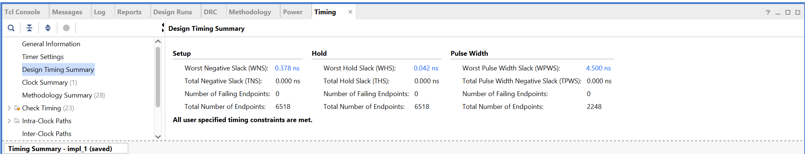

5. Note the value of the Worst Negative Slack (WNS). This is the difference 
   between the clock period and the design's critical path delay. If this value 
   is greater than or equal to 0, your design has met timing requirements. 
   Otherwise, if it is less than 0, your design has failed to meet timing and 
   the critical path delay is over 10.00ns.

Keep the Worst Negative Slack above 0 by breaking up large blobs of 
combinational logic with registers, and your design is guaranteed to work 
"as you coded it."  Let it fall below 0, and all bets
are off.  _HINT: trying to add eight 16-bit values in a single clock cycle is
probably not going to work :)_.

For this project, your system must meet the timing requirements of the
100MHz clock, and must have a Worst Negative Slack greater than or equal to 0.

## Clock Constraints

If you want to tell Vivado what your clock is, then do the following:

1. Run Synthesis on your design (you don't need to run Implementation).

2. From the Flow Navigator window (on the left), expand the menu under 
   **Open Synthesized Design** by clicking on the arrow, then open the 
   **Constraints Wizard**. You should see a window that looks like the 
   following:
   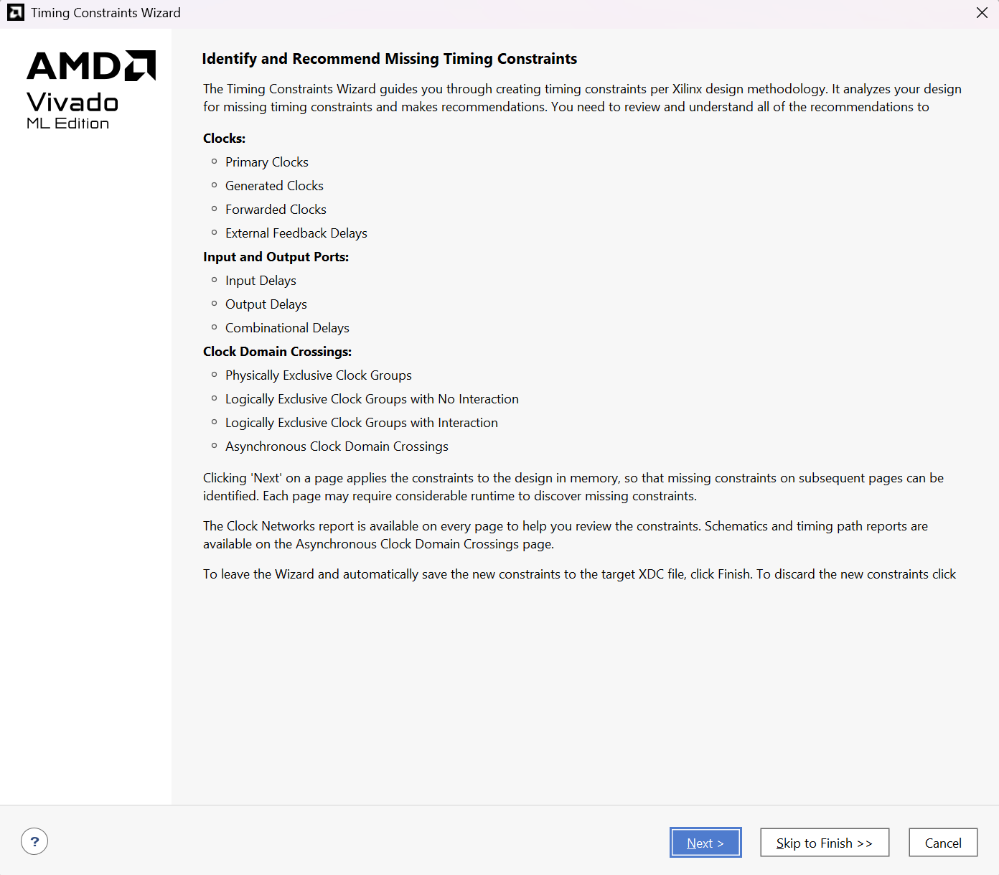

3. Click on the blue "Next" button. You should see a window titled 
   **Primary Clocks**. The Boolean Board's clock signal, CLOCK_100, should show
   up under the **Recommended Constraints** window. It should look like the 
   following:
   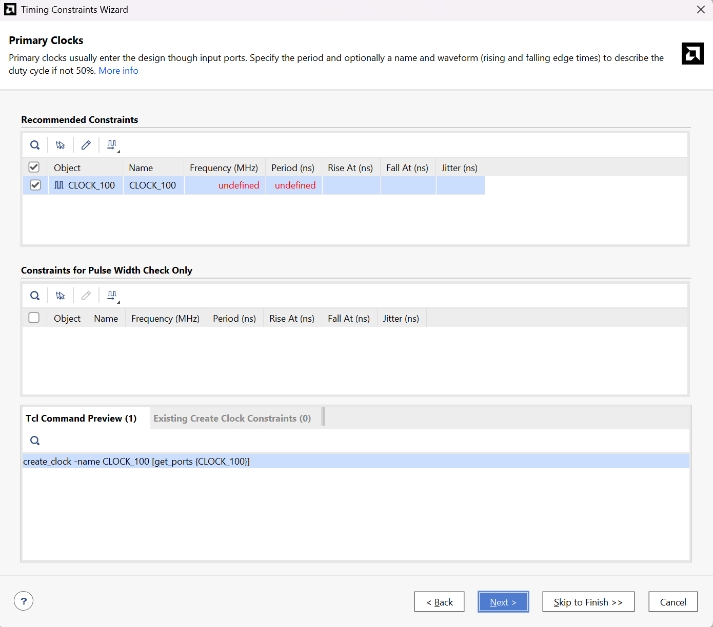

4. Enter a frequency of 100 MHz under the "Frequency" tab and press Enter. Make
   sure that the tickbox next to CLOCK_100 is selected, and that the period is 
   now 10.000ns. Then, click on "Skip to Finish" at the bottom of the screen. 
   Finally, click the blue "Finish" button to exit the wizard. 

5. The appropriate clock constraint should now be set up. It will be used to 
   evaluate your design's timing parameters on the next Synthesis/Implementation
   run. Refer to the section on **Timing Requirements** for instructions on 
   how to view these timing parameters.

## For Credit

You will be graded on getting the right answer to the calculation, on the number
of clock ticks it takes to do the calculation (smaller is better), if it meets
timing, and your coding style.  We expect your solution to be pipelined and will 
penalize appropriately if it is not.

The number of clock ticks?  Yes, since the chip we have has lots of multiply
units and block RAMs, you can organize the hardware and the **A** and **B**
matrices (and copies of them) so that the calculations can run concurrently.
You can use all of the hardware you want but the question is how fast can you
make it run?  You should count all clock ticks from when reset is no longer
asserted and the calculation starts, until when the result of the calculation is
stored in a register.  After that, the clock tick counter doesn’t increment.

Getting the right answer?  Note that you can organize your data in different
ways to obtain fast implementations.  You can apply some algebraic manipulations
if you think it will be better. And remember, we’re only interested in the final
summation of the **Y** vector.  Actually, due to the limits on displays, we 
actually are only interested in the least significant 32-bits of the 
summation of the **Y** vector.

BTW, you must use the multiply and block RAM special features.  I'm not sure why
you wouldn't, but I've heard reports of student is previous semesters trying to
skip by without learning about the FPGA components.  So sad for them...

Note that we will give a lot of points for just getting it to run.  Getting it
to run faster is worth more, see the grading sheet.  512 clock cycles is
effectively your "speed of light" target, but don't worry if your design is
a bit slower.  Do make sure you're not truncating intermediate values though,
otherwise you might be fast but inaccurate!

**Strong Advice**: You are strongly advised to try to build a very slow system 
to start.  Don't try to optimize your design right away.  Rather, make sure 
you can get the correct answers.  As you build that, you will undoubtedly learn
a few things, which will make your design work go so much better when you 
start to optimize.  Also, from a point perspective, getting the slowest possible
multiplier that works is worth many, many more points than getting the 
fastest possible multiplier that doesn't work.

## Setting Up your Vivado Project (Timeline)

We recommend that you follow this set of steps when developing your Matrix 
Multiply solution:

1. Start a project in Vivado with the New Project Wizard. When prompted 
to add design sources to the project, add the following files:

   * matrix_multiply.sv
   * 7SegmentDisplay.sv
   * SSegDisplayDriver.sv

2. When prompted to add constraints, add the following file: **boolean341.xdc**

3. When prompted to select a board/part, choose this board: **xc7s50csga324-1**
   
4. Generate Multiplier and Block RAM modules as described in the
   **Multiplier and Block RAM Module Generation** section below.
   Make sure to load each Block RAM module with a corresponding .coe 
   file - either matA.coe, matB.coe, or matC.coe.

5. Develop your solution in **matrix_multiply.sv**. Synthesize or
   simulate as needed.

6. Configure a clock constraint for the default 100 MHz clock (see
   the section on **Clock Constraints**). Note that you can't do this with an
   empty design/solution, you must have some logic in your matrix_multiply.sv 
   file for the constraint wizard to work. We recommend that you wait to do this
   until you're ready to test the first iteration of your solution.

## Multiplier and Block RAM Module Generation

To make use of the multiply and Block RAM special features on the 
Boolean Board, you need to generate multiplier and Block RAM 
modules using Vivado.

First, to generate Block RAM modules for each of the three matrices (**A**, **B**, and 
**C**), you can do the following:

1. In your Vivado project, go to the Flow Navigator window (on the left). 
   Expand the "Project Manager" section and then open the **IP Catalog**.

2. Search for "bram" in the IP Catalog menu. Scroll down until you find the 
   **Block Memory Generator**, and double-click to open it. You should see a 
   window that looks like the following:
   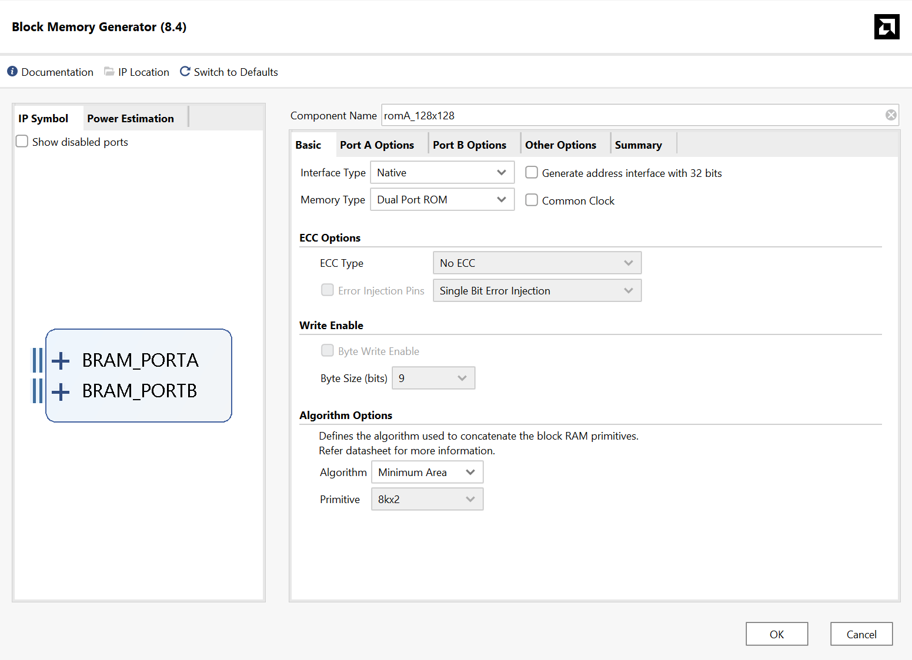

3. You want to generate a dual-port ROM (read-only memory) for each of the 
   three matrices. Make sure to set the component name to either "romA_128x128", 
   "romB_128x1" or "romC_128x1" depending on which matrix you're generating the 
   module for. Make sure to select the exact same parameters as in the image 
   above.

4. Move to the **Port A Options** tab. Your Block RAM should have a width and 
   depth corresponding to the size of the matrix that you're generating it for. 
   For matrix **A** you want a width of 8 and a depth of 16384 
   (that's 128 x 128); For matrix **B** you want a width of 8 and a depth 
   of 128; For matrix **C** you want a width of 16 and a depth of 128. Set the 
   Enable Port Type to "Always Enabled" and also untick the 
   "Primitives Output Register" checkbox. Make sure to select the exact same 
   parameters as in the image below:
   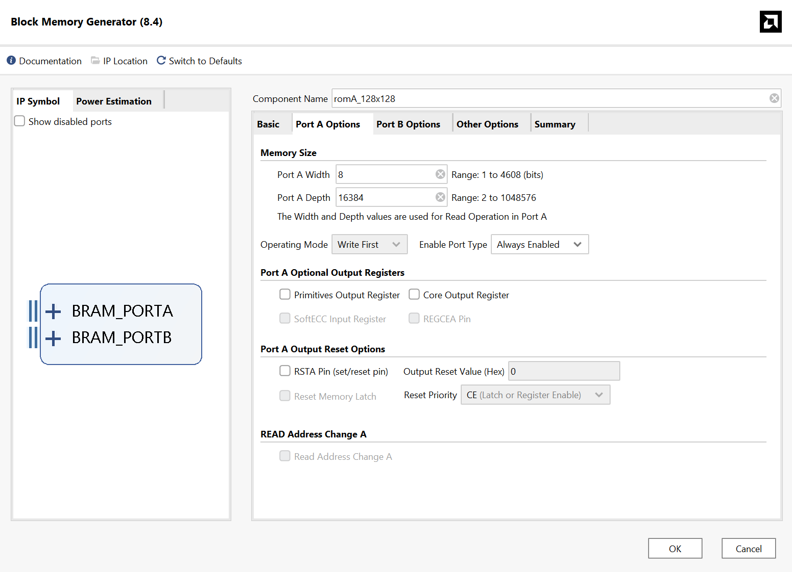

5. Move to the **Port B Options** tab. Select the same parameters as in the 
   **Port A Options** tab, as show in the image below:
   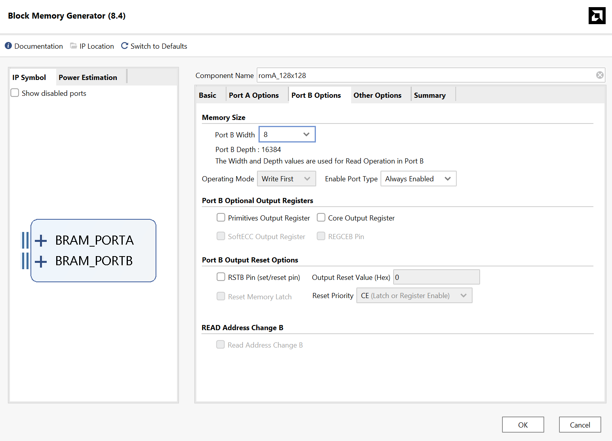

6. Finally, move to the **Other Options** tab. You want to enable the "Load 
   Init File" checkbox. Then, click on "Browse" and select the path to the 
   .coe file for your matrix. Use either matA.coe, matB.coe, or matC.coe 
   depending on which matrix you're generating the module for. We have provided 
   .coe files for you, and you can also generate new (random) ones using the 
   generate_matrix.py script. See the **Model Organization** section for more
   details. Also, make sure to enable the "Fill Remaining Memory Locations"
   checkbox, and set all remaining memory locations to 0. See the image below
   for reference:
   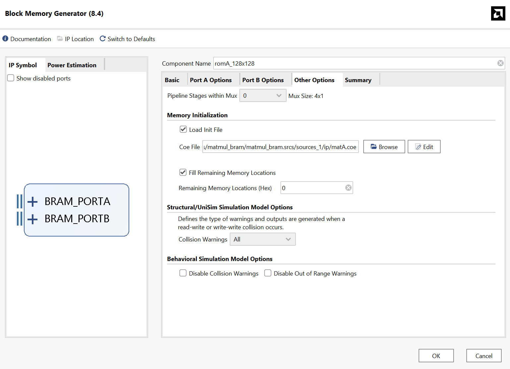

8. Click the "OK" button to exit out of the wizard. Then, click through the 
   remaining prompts to generate the module. Once the generation process is 
   complete, the new module will show up as a design source under the 
   "IP Sources" tab. Remember to do this for each of the three Block RAM 
   modules.

Then, to generate a multiplier for two 8-bit input values, you can do the following:

1. Open the **IP Catalog** again, under the "Project Manager" section of the 
   Flow Navigator. Then, search for "multiplier" in the IP Catalog menu. Scroll 
   down until you find an entry called "Multiplier" (not "Complex Multiplier"), 
   and double-click to open it. You should see a window that looks like the 
   following:
   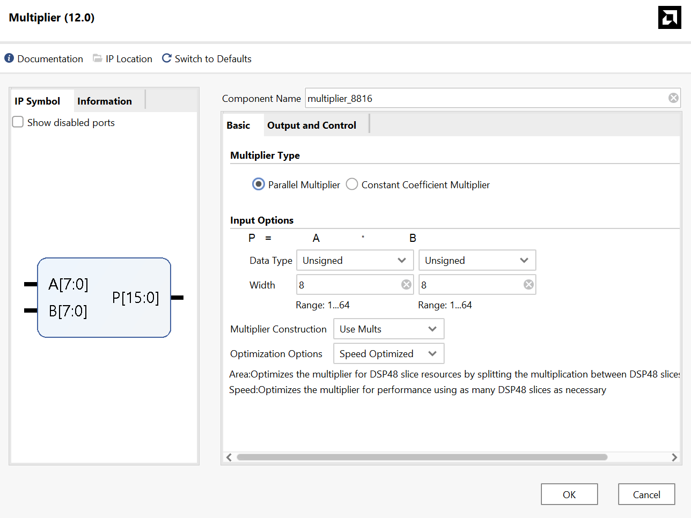

2. You want to generate a parallel multiplier that multiplies two unsigned 8-bit
   values, and outputs a 16-bit result. Your module should be set to "Use Mults"
   and be "Speed Optimized", to allow for a higher clock frequency. Also, you 
   need to set the component name to "multiplier_8816". Make sure to select the 
   exact same parameters as in the image above.

3. Move to the **Output and Control** tab. Your multiplier module should be 
   combinational, so you need to set the number of pipeline stages to 0. Make 
   sure to select the exact same parameters as in the image below:
   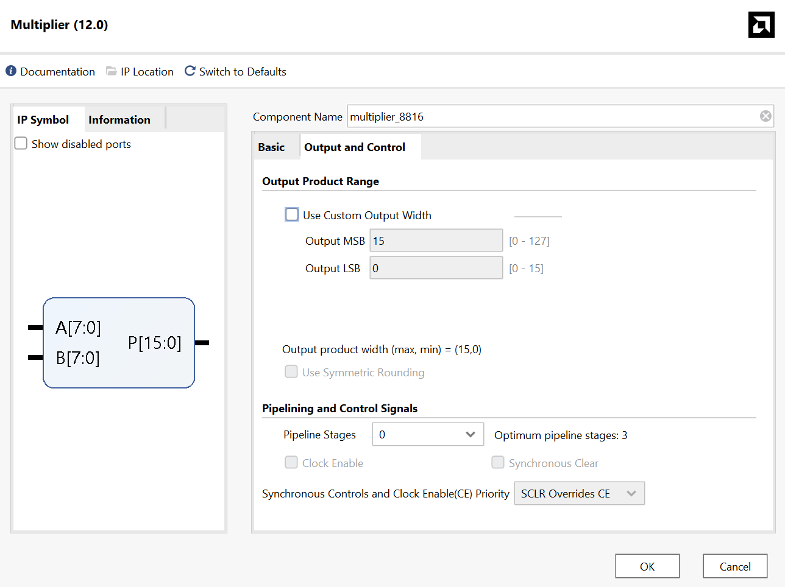

4. Click the "OK" button to exit out of the wizard. Then, click through the 
   remaining prompts to generate the module. Once the generation process is 
   complete, the new module will show up as a design source under the 
   "IP Sources" tab.

## Model Organization

The header for your module should resemble the following:

```systemverilog
module ChipInterface
  (input  logic       CLOCK_100, // 100 MHZ Clock
   input  logic [15:0] SW,
   input  logic [ 3:0] BTN,
   output logic [ 7:0] D0_SEG, D1_SEG,
   output logic [ 3:0] D0_AN, D1_AN);
```

**BUTTON0**, when depressed, will reset the system.  

Develop your code in a file called **matrix_multiply.sv**.  There is really no
TA testbench for this project.  It just runs on the Boolean Board and shows its
results.  To do the calculation again, hit reset (you should get the same
result).  That being said, feel free to make your own using the template 
(matmul_test.sv)!

The ROMs and multiplier that you will instantiate are detailed below.  The two
matrices (ROMs) are initialized via the \*.coe files. We are providing two
different **A**, **B**, and **C** matrices. The **A** matrix is provided in
contiguous row-major order.

* [matA_1.coe](matA_1.coe), [matB_1.coe](matB_1.coe), [matC_1.coe](matC_1.coe)
  will produce the result **32'h0E8502FA**.

* [matA_2.coe](matA_2.coe), [matB_2.coe](matB_2.coe), [matC_2.coe](matC_2.coe)
  will produce the result **32'h103E5507**.

To use these, copy one set (e.g., all \*\_1.coe, or all \*\_2.coe) of files to
the **matA.coe**, **matB.coe**, and **matC.coe** files. Then, under the 
Sources/IP Sources window, right click on each ROM and then click on 
**"Reset Output Products"** followed by **"Generate Output Products"**. 
The result given above is what you should expect to see if you’ve done the 
calculations correctly.

We have also provided a python script [generate_matrix.py](generate_matrix.py),
which you can use to generate a random problem if you like (it even prints out
the answer).  We will be grading you with a random problem generated from this
python program.

```sh
$ python generate_matrix.py matA_gen.coe matB_gen.coe matC_gen.coe

Matrix files created: matA_gen.coe matB_gen.coe matC_gen.coe
Accumulated product: 0x1089779d
```

To make use of the Block RAM and multiplier modules you generated, instantiate, 
connect and use the module headers listed below.  If you deviate too much from
these, then the synthesis tool won't recognize that you want the component and
will do something else entirely.

Here are the headers of the component modules in a somewhat cleaned up format.

```systemverilog
module romA_128x128
  (input  logic clka,
   input  logic [13:0] addra,
   output logic [ 7:0] douta,
   input  logic clkb,
   input  logic [13:0] addrb,
   output logic [ 7:0] doutb);
  
endmodule : romA_128x128

module romB_128x1
  (input  logic clka,
   input  logic [6:0] addra,
   output logic [7:0] douta,
   input  logic clkb,
   input  logic [6:0] addrb,
   output logic [7:0] doutb);

endmodule : romB_128x1

module romC_128x1
  (input  logic clka,
   input  logic [ 6:0] addra,
   output logic [15:0] douta,
   input  logic clkb,
   input  logic [ 6:0] addrb,
   output logic [15:0] doutb);

endmodule : romC_128x1
```

**romA_128x128** contains 16384 one-byte wide elements, hence the 14 bit address lines.
**romB_128x1** contains 128 one-byte wide elements, hence 7 bits for address lines.
**romC_128x1** contains 128 two-byte wide elements, hence 7 bits for address lines.

The ROMs are dual ported and thus you can provide two addresses and read two
elements simultaneously.  **addra** address line provides the data read on
**douta**. The same is true for **addrb** and **doutb**. The two ports have 
separate clock inputs **clka** and **clkb**. For this project, please connect 
both clock inputs on each ROM to the same clock signal (CLOCK_100).

The ROMs have registered inputs but **unregistered** outputs, meaning that the
ROM loads the address values into its own internal registers at each clock edge.
The results read from the ROM appear on **douta** and **doutb** after that clock
edge.  So, you present the addresses in one state and read the results in the
next.

The data in **romA_128x128** is defined by **matA.coe**, **romB_128x1** data is
defined by **matB.coe**, and finally **romC_128x1** data is defined by
**matC.coe**.  By specifying values for the ROM data, the on-chip implementation
of the ROMs will be initialized to these values.  See the note above about the
two different sets of **A**, **B**, and **C** we have provided.

Hardware usage on the chip: **romA_128x128** uses 4x 36Kb Block RAMs,
**romB_128x1** uses 1x 18Kb Block RAM, and **romC_128x1** uses 1x 18Kb
Block RAM.  The Spartan 7 chip has a total of 75 36Kb Block RAMs, each of which 
can be split into two 18Kb Block RAMs, for a total of 150 18Kb Block RAMs. 
Kudos if you can figure out why these are 36Kb and 18Kb memories instead of 
32Kb or 16Kb ones :).

The embedded multiplier has a module header that looks like:

```systemverilog
module multiplier_8816
  (input  logic [ 7:0] A,
   input  logic [ 7:0] B,
   output logic [15:0] P);

endmodule : multiplier_8816
```

This is a byte multiplier that produces a 16-bit result.  Simply connect the two
operands into **A** and **B**, and then patiently wait for the result to
show up on the **P** output _combinationally_.

Hardware usage on the chip: the above uses one 25x18 multiplier. The Spartan-7 
XC7S50-CSGA324 chip has 120 such (independent) multipliers.

## Simulating with Vivado

If you want to debug your design, you're not going to have any fun sitting in
the lab synthesizing and downloading again and again.  The modules that tell
Vivado to use the special hardware units (like the roms and multiplier)
conveniently come with functional models that can be used in simulation. 

To simulate, you need to:
1. Create new testbench file that resets the system and drives `clk`
2. Add your new testbench file as a simulation source. Review the Vivado Tutorial
   on Canvas if you are unfamiliar with adding files to your project.
3. Click "Run Simulation -> Run Behavioral Simulation" under the Flow Navigator:
   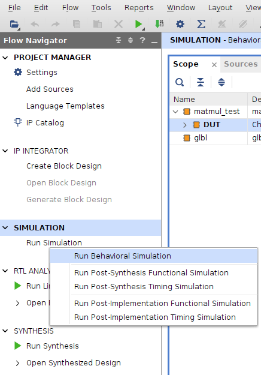

**Note:**
Vivado limits the simulation runtime to 1000ns by default, even if you set a longer 
delay in your testbench. You may need to increase this limit to properly simulate 
your design. You can do this by opening the Simulation Settings, like so:

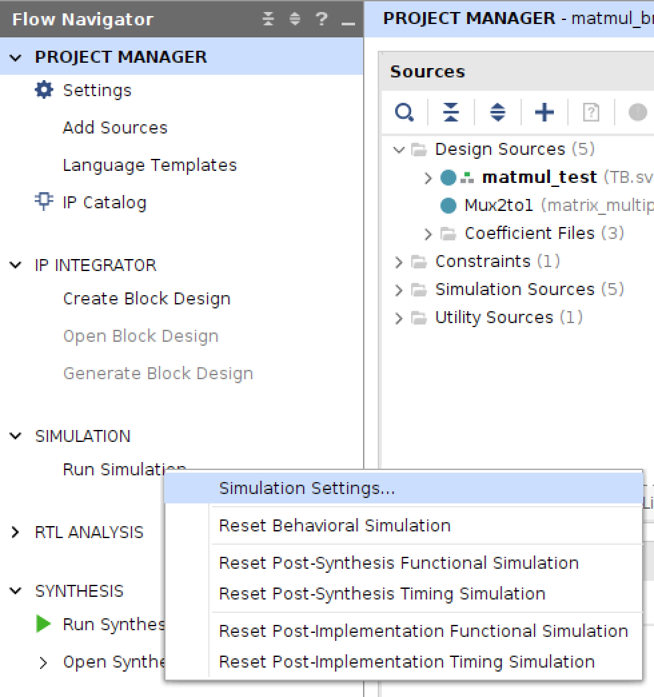

Select the "Simulation" tab under "Project Settings" on the left, and then select the 
"Simulation" tab in the menu on the bottom-right. You should see a property called 
**xsim.simulate.runtime**, you'll want to increase this beyond the default value of 
1000ns, to 10000ns or more. See the image below for reference: 

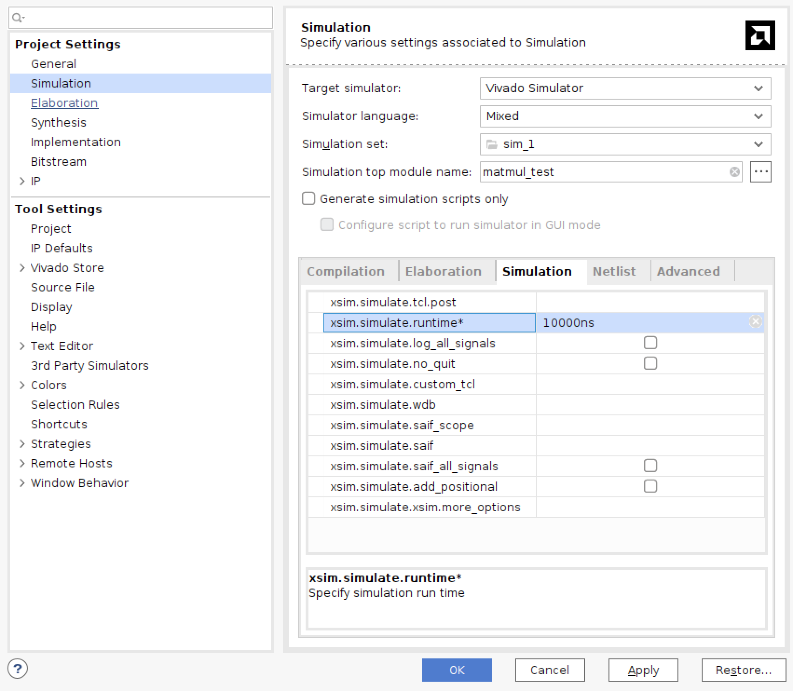

More information on using the Vivado Simulator can be found here:
https://docs.amd.com/r/en-US/ug900-vivado-logic-simulation/Simulating-with-Vivado-Simulator

**Potential Simulation Bugs with IP Blocks (How to Fix):**
Sometimes, you may encounter bugs with Vivado's simulator when you're simulating 
the generated IP blocks (BRAMs and multipliers). Specifically, your 
BRAMs or multipliers may be outputting XXs instead of actual values, even when 
all of their inputs are properly initialized. To fix such bugs, you can try 
following the steps below:
1. Close Vivado
2. Delete the .cache/, .runs/, and .sim/ folders in your project directory
3. Reopen Vivado
4. Go to the IP Sources tab. Then, right click on each BRAM and click on
**Reset Output Products** followed by **Generate Output Products**
5. Run the simulation

If this doesn't help, as a last resort, you can try remaking your entire
project from scratch.

## Some Other Things you Should Learn

In the last project, I introduced you to the Boolean Board User Manual.  That 
manual isn't as useful for this project, as we are trying to use components that 
aren't part of the board, but are part of the FPGA itself.  Therefore, you should 
get to know a different set of manuals — the AMD 7 Series FPGA User Guides and Data 
Sheets. These guides can be found on 
[AMD's Technical Information Portal](https://docs.amd.com/search/all?query=7+Series+FPGAs+Data+Sheet%253A+Overview+(DS180)&value-filters=Document_Type_custom~%2522Data+Sheet%2522_%2522User+Guides+%2526+Manuals%257CUser+Guide%2522*Product_custom~%2522Adaptive+SoCs+%2526+FPGAs%257CFPGA%257CSpartan+7%2522&content-lang=en-US). 
These user guides describe, in great detail, everything that happens inside the FPGA. 
For a general overview of the Spartan 7 FPGA, see this [user guide](https://docs.amd.com/v/u/en-US/ds180_7Series_Overview).
If you wanted to know how the multipliers work ("hmm. I wonder if the multiplier can work 
on signed values?") see this [user guide](https://docs.amd.com/v/u/en-US/ug479_7Series_DSP48E1). 
If you wanted to know how the memory blocks work ("hmm. I wonder if they support dual-port mode?") 
see this [user guide](https://docs.amd.com/v/u/en-US/ug473_7Series_Memory_Resources).

Please take a few minutes to skim through the user guides above. The AMD Technical Information 
Portal has many other user guides as well, if you'd like to know more about how the FPGA works.

You should be using `generate` statements to instantiate (almost) all those
embedded memories and multipliers.

## How To Turn In Your Solution

Here's a reminder of the steps you should follow to submit your GitHub repo
to Gradescope:

1. Do Git stuff:
  ```sh
$ git branch gradescope_final
$ git checkout gradescope_final
$ git add --all
$ git commit -m "My final submission.  Yay, I'm done!"
$ git push -u origin gradescope_final
$ git tag -a final -m "Final submission for 18341 P2"
$ git push --tags  
  ```

2. Log onto Gradescope and select the P2: Matrix Multiply assignment.

3. Select the repo you want to submit.

4. Press submit!

## 341 Linter

Your repo will include the 341 "Linter" that will show up on git commits as "Slang/Tidy,"  just like in the Warmup project.  We hope it is useful to you.  We will not
be using the linter output for grading.

## Demos and Late Penalty

We will have demo times outside of class times on or near the due date.  Since
we will demo from the files in your repo, it is possible that you’ll demo on a
following day.

**Define Late:**  Lateness is determined by the file dates of your repo.

**Grace Day:**  You may use your grace day to turn in the solution up to 24
hours late.  If you do not intend to use a grace day (or have already used
yours), make sure you have something in the repo (and have pushed the repo) at
the deadline to avoid getting a zero on this project.
